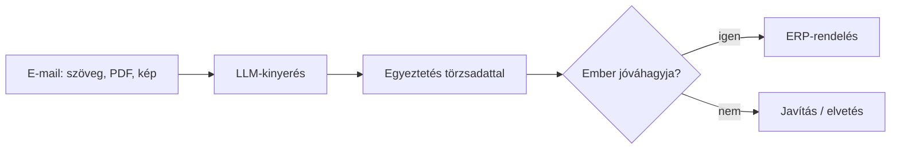

## Hol tartok

_Jegyzet: húsz év, integráció, mit szerettem benne._

## Mi változott

_Jegyzet: a kódírás mint tevékenység leértékelődik, a rendszer összerakása és a felelősség nem._

## Miért nem „AI-tanácsadó”

_Jegyzet: a domain + AI kombó, konkrét példa (rendelés e-mailből ERP-be)._

<!-- TODO: vázlat-ábra a mermaid teszteléséhez – igazítsd vagy töröld -->

## Hogyan csinálom

_Jegyzet: tanfolyam + saját motor párhuzamosan, napi blokkok._

## Mit találsz itt a következő hónapokban

_Jegyzet: TODO_
